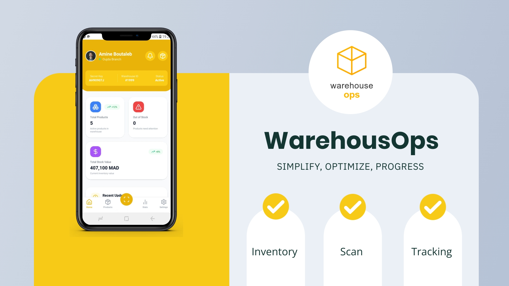

# WarehouseOps



## Overview

WarehouseOps is a comprehensive inventory management application designed to streamline warehouse operations. It allows users to manage products, track stock levels, and perform barcode scanning for efficient inventory control. The application is built using React Native and Expo, providing a smooth user experience across mobile devices.

## Features

- **Product Management**: Add, edit, and delete products in the inventory.
- **Barcode Scanning**: Quickly search for products using barcode scanning functionality.
- **Stock Tracking**: Monitor stock levels and receive alerts for low stock items.
- **User Authentication**: Secure login for warehouse personnel.
- **Statistics Dashboard**: View key metrics such as total products, out-of-stock items, and total stock value.
- **Responsive Design**: Optimized for both iOS and Android devices.

## Technologies Used

- **Frontend**: React Native, Expo
- **State Management**: Redux Toolkit
- **Navigation**: React Navigation
- **API**: RESTful API for data management
- **Database**: JSON file for local development (can be replaced with a real database)

## Project Structure

```
└─ .
   ├─ .env
   ├─ .env.example
   ├─ .expo
   │  ├─ devices.json
   │  ├─ README.md
   │  ├─ types
   │  │  └─ router.d.ts
   │  └─ web
   │     └─ cache
   │        └─ production
   │           └─ images
   ├─ api
   │  ├─ config.ts
   │  ├─ database
   │  │  └─ db.json
   │  ├─ productsApi.ts
   │  ├─ statisticsApi.ts
   │  └─ warehousemansApi.ts
   ├─ app
   │  ├─ (tabs)
   │  │  ├─ home
   │  │  │  ├─ index.tsx
   │  │  │  └─ _layout.tsx
   │  │  ├─ products
   │  │  │  ├─ add.tsx
   │  │  │  ├─ index.tsx
   │  │  │  ├─ [id].tsx
   │  │  │  └─ _layout.tsx
   │  │  ├─ scan
   │  │  │  ├─ index.tsx
   │  │  │  └─ _layout.tsx
   │  │  ├─ settings
   │  │  │  ├─ index.tsx
   │  │  │  ├─ warehouse-details.tsx
   │  │  │  └─ _layout.tsx
   │  │  ├─ stats
   │  │  │  ├─ index.tsx
   │  │  │  └─ _layout.tsx
   │  │  └─ _layout.tsx
   │  ├─ index.tsx
   │  ├─ login
   │  │  └─ index.tsx
   │  └─ _layout.tsx
   ├─ app.json
   ├─ assets
   │  ├─ fonts
   │  │  └─ SpaceMono-Regular.ttf
   │  └─ images
   │     ├─ adaptive-icon.png
   │     ├─ favicon.png
   │     ├─ icon.png
   │     ├─ icon.svg
   │     ├─ Illustration01.png
   │     ├─ splash-icon.png
   │     └─ WarehouseOps.png
   ├─ babel.config.js
   ├─ components
   │  ├─ Collapsible.tsx
   │  ├─ common
   │  │  ├─ ErrorMessage.tsx
   │  │  ├─ Header.tsx
   │  │  ├─ Input.tsx
   │  │  ├─ Loading.tsx
   │  │  ├─ LoadingSpinner.tsx
   │  │  ├─ QuickActionButton.tsx
   │  │  └─ StatCard.tsx
   │  ├─ ExternalLink.tsx
   │  ├─ HapticTab.tsx
   │  ├─ HelloWave.tsx
   │  ├─ ParallaxScrollView.tsx
   │  ├─ products
   │  │  ├─ AddProduct.tsx
   │  │  ├─ ProductCard.tsx
   │  │  ├─ ProductList.tsx
   │  │  ├─ QuantityEditModal.tsx
   │  │  └─ RecentProductCard.tsx
   │  ├─ search
   │  │  ├─ ActiveFilters.tsx
   │  │  ├─ CategoryList.tsx
   │  │  ├─ FilterPanel.tsx
   │  │  └─ SearchHeader.tsx
   │  ├─ ThemedText.tsx
   │  ├─ ThemedView.tsx
   │  ├─ ui
   │  │  ├─ bottom-sheet.tsx
   │  │  ├─ IconSymbol.ios.tsx
   │  │  ├─ IconSymbol.tsx
   │  │  ├─ TabBarBackground.ios.tsx
   │  │  └─ TabBarBackground.tsx
   │  └─ __tests__
   │     ├─ ProductCard.test.tsx
   │     ├─ ProductList.test.tsx
   │     └─ RecentProductCard.test.tsx
   ├─ constants
   │  └─ Colors.ts
   ├─ expo-env.d.ts
   ├─ global.css
   ├─ hooks
   │  ├─ useAuth.ts
   │  ├─ useColorScheme.ts
   │  ├─ useColorScheme.web.ts
   │  ├─ useProducts.ts
   │  ├─ useStatistics.ts
   │  └─ useThemeColor.ts
   ├─ metro.config.js
   ├─ nativewind-env.d.ts
   ├─ package-lock.json
   ├─ package.json
   ├─ README.md
   ├─ scripts
   │  └─ reset-project.js
   ├─ store
   │  ├─ slices
   │  │  ├─ authSlice.ts
   │  │  ├─ productsSlice.ts
   │  │  └─ statisticsSlice.ts
   │  └─ store.ts
   ├─ tailwind.config.js
   ├─ tsconfig.json
   ├─ types
   │  ├─ home.types.ts
   │  ├─ product.ts
   │  └─ search.types.ts
   ├─ utils
   │  ├─ auth.ts
   │  └─ reportGenerator.ts
   └─ __snapshots__
```

## Installation

### Prerequisites

- Node.js (version 14 or higher)
- Expo CLI

### Steps

1. Clone the repository:

   ```bash
   git clone https://github.com/elmorjanimohamed9/WarehouseOps.git
   cd WarehouseOps
   ```

2. Install dependencies:

   ```bash
   npm install
   ```

3. Set up environment variables:

   Create a `.env` file in the root directory and add the following:

   ```
   EXPO_PUBLIC_API_URL=http://your-api-url.com
   ```

4. Start the development server:

   ```bash
   npm start
   ```

5. Open the app in an emulator or on a physical device using the Expo Go app.

## Usage

- **Login**: Use your credentials to log in to the application.
- **Dashboard**: View the statistics and manage products from the dashboard.
- **Barcode Scanner**: Use the scanner to quickly find products by scanning their barcodes.
- **Add Product**: Navigate to the add product screen to input new product details.

## Contributing

Contributions are welcome! If you have suggestions for improvements or new features, please open an issue or submit a pull request.

1. Fork the repository.
2. Create a new branch for your feature or bug fix.
3. Make your changes and commit them.
4. Push to your branch and open a pull request.

## Contact

For any inquiries or feedback, please reach out to:

- **El Morjani Mohamed**: [elmorjanimohamed9@gmail.com](mailto:elmorjanimohamed9@gmail.com)
